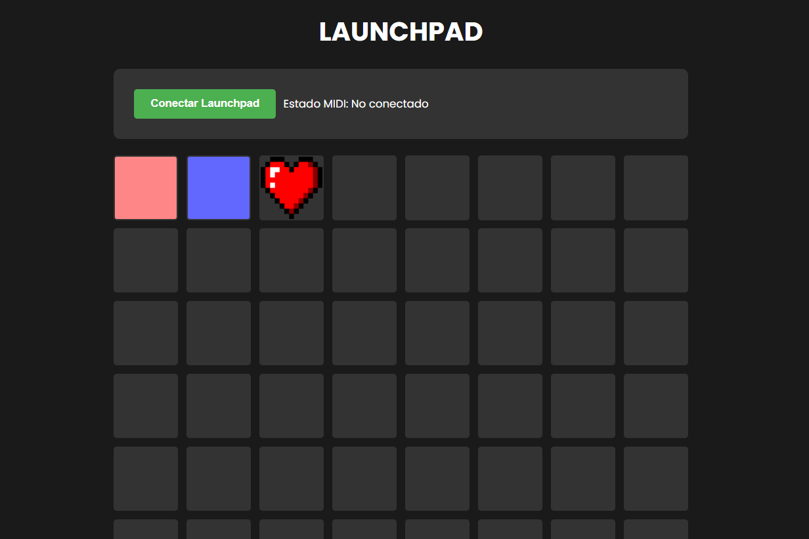

# 🎛️ Launchpad Emulator


Un emulador de Launchpad interactivo basado en web que permite cargar, reproducir y manipular sonidos a través de una interfaz tipo grid. Perfecto para músicos, productores y entusiastas del audio digital.

## ✨ Características

- 🎹 Grid de 8x8 pads interactivos
- 🎵 Soporte para carga y reproducción de archivos de audio
- 🎨 Personalización de colores para cada pad
- 🖼️ Soporte para imágenes en pads
- 🎯 Drag & drop de sonidos predefinidos
- ⌨️ Control mediante teclado
- 🎼 Integración con dispositivos MIDI (Novation Launchpad)
- 🔄 Animaciones visuales
- 📱 Diseño responsive

## 🚀 Demo



## 🛠️ Tecnologías Utilizadas

- HTML5
- CSS3
- JavaScript (ES6+)
- Web MIDI API
- Web Audio API

## ⚙️ Instalación

1. Clona el repositorio:

```bash
git clone https://github.com/pandafter/LauchpadWEB.git
```

2. Navega al directorio del proyecto:

3. Abre `index.html` en tu navegador o usa un servidor local.

## 🎮 Uso

### Controles de Teclado

| Tecla | Función                   |
| ----- | ------------------------- |
| Q-I   | Primera fila de pads      |
| A-K   | Segunda fila de pads      |
| Z-M   | Tercera fila de pads      |
| 1-9   | Pads de control           |
| Space | Detener todos los sonidos |

### Funciones de los Pads

- **Click Izquierdo**: Reproducir/Detener sonido
- **Click Derecho**: Menú contextual
  - Cargar Audio
  - Cambiar Color
  - Cambiar Imagen
  - Eliminar Audio/Imagen

## 🔌 Conexión MIDI

1. Conecta tu Novation Launchpad
2. Click en "Conectar MIDI"
3. Selecciona tu dispositivo
4. ¡Listo para usar!

## 📁 Estructura del Proyecto

```
launchpad-emulator/
├── index.html
├── styles.css
│
├── lauchpad.js

```

## 🤝 Contribuir

1. Fork el proyecto
2. Crea tu rama de características (`git checkout -b feature/AmazingFeature`)
3. Commit tus cambios (`git commit -m 'Add some AmazingFeature'`)
4. Push a la rama (`git push origin feature/AmazingFeature`)
5. Abre un Pull Request

## 📝 Licencia

Este proyecto está bajo la Licencia MIT - ver el archivo [LICENSE.md](LICENCE.md) para detalles.

## 👤 Autor

Tu Nombre

- GitHub: [@tu-usuario](https://github.com/pandafter)
- LinkedIn: [@tu-usuario](https://linkedin.com/in/juanleyvah)

## 🙏 Agradecimientos

- [Web MIDI API](https://developer.mozilla.org/en-US/docs/Web/API/Web_MIDI_API)
- [Web Audio API](https://developer.mozilla.org/en-US/docs/Web/API/Web_Audio_API)
- Novation por la inspiración del Launchpad

## 📊 Roadmap

- [ ] Soporte para múltiples bancos de sonidos
- [ ] Guardado de configuraciones
- [ ] Exportación/Importación de proyectos
- [ ] Modo performance
- [ ] Efectos de audio
- [ ] Secuenciador integrado

---

⌨️ con ❤️ por [Nicolas Leyva](https://github.com/pandafter)
